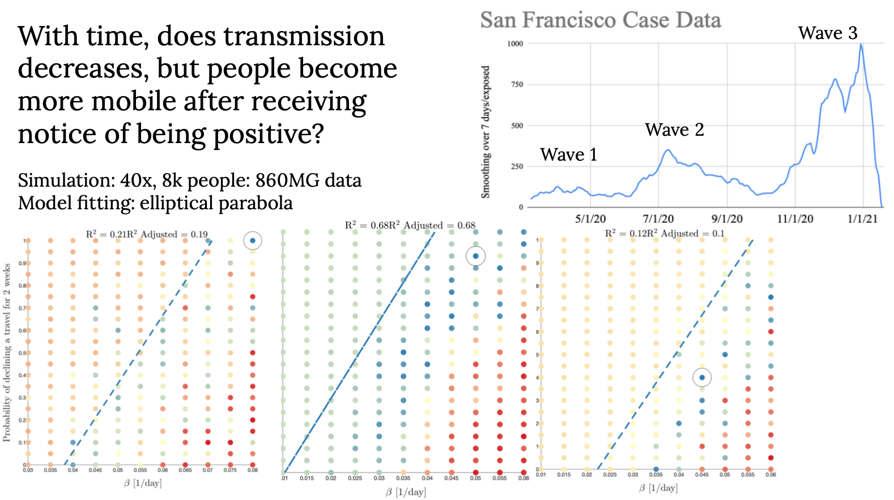
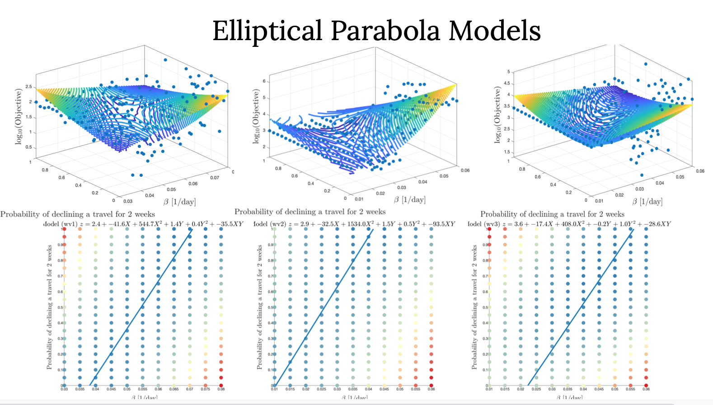
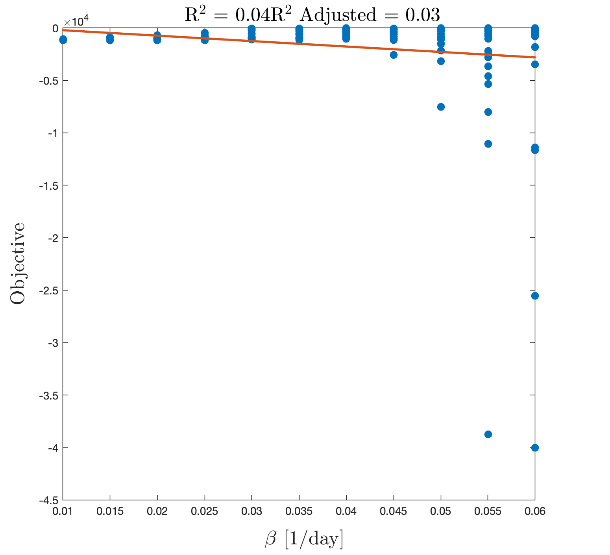
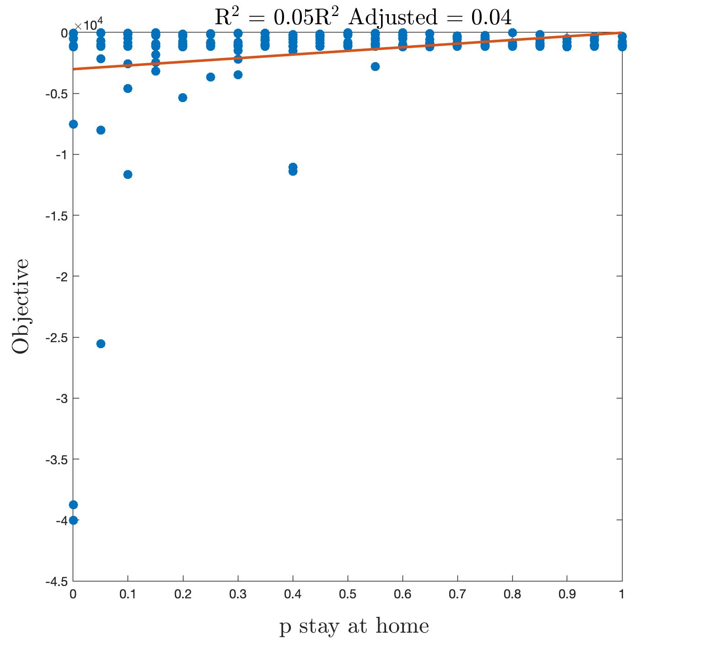
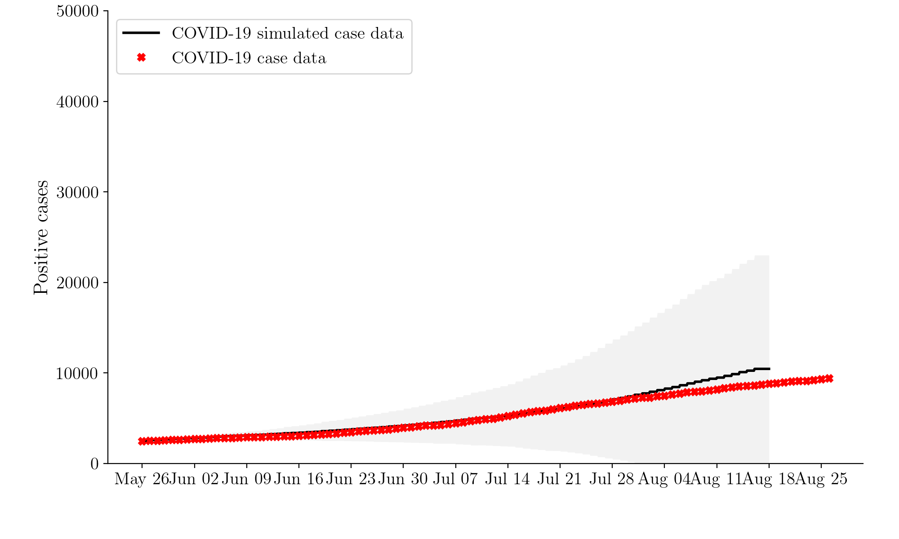

# A Spatiotemporal Epidemic Model to Quantify The Effects of Testing, Contact Tracing and Containment

This repository contains scripts and notebooks to analyze data from San Francisco, CA, USA COVID-19 cases and from a spatiotemporal epidemiology model data with alteration from Stanford Future Bay Initiative [paper](https://arxiv.org/abs/2004.07641). Here, I describe two problems. The first analyzes the best transmission values and human behavior once tested positive for each wave of the pandemic. The second problem specifically looks at manual contact tracing and the impact it had on Wave 2 of the pandemic. 

## Understanding the Model

One of the interesting aspects that is true for most natural disasters is that each individual has a different perspective of the pandemic than what the collective description would have us believe. Some of has gotten the virus whereas others have not. Some of us are more likely to stay at home once sick, whereas others are not. It is valuable to describe this behavior. There are multiple epidemiology models that are build to better characterize the pandemic. However, all models are incorrect, only some will actually provide us with the valuable knowledge. Here, we use simulator that models individual behavior and shopping patters as recorded by SafeGraph Data. Using this model, we have ran multiple simulations at different transmission values and probability of staying at home after positive test values, then compared it to SF Case Data. Below, each dot corresponds to a pair of transmission rate and likelihood of staying home. Each dot is an average of 10 random instances with this pairing. We compare that to actual SF data, where red corresponds to large differences in cases and blue corresponds to low differences in cases. The dark blue circled is the best data. 

<p align="center">

</p>

San Francisco manual contact tracing teams say that after someone is tested positive, they are able to reach 85% of the positively tested individuals. They provide them resources to stay at home. Thus, in an ideal world, about 85% of the population should shelter at home once tested positive. The above results do not suggest thats true. Thus, we fit a model line through the simulation to show that if 85% of the cases do stay at home, then how the transmission rate would change. 

We predict that the relationship would create a taco in space,  or rather an elliptical parabola. Using the data, we create a best fit model that fits the equation ($z = a + bx + cy+ dxy + ex^2 + fy^2$ ). The gradient of z with respect to x and y then set to 0, would give us an x-y relationship, which is what we plot here. 

<p align="center">

</p>

A single parameter regression is not effective predictor because there is a dependence on both parameters. We see that the best when we do a best fit model with each parameter. Below, you see the results for Wave 2. The above analysis are provided in [plot_bayopt.m](lib/plot_bayopt.m). Given that I am most comfortable with Matlab, the plots and analysis were writen in Matlab. 

<p align="center">


</p>

### Remaining Questions
1. What improvements should I make to increase the model fit parameters like R^2 value?
2. How do we turn this into a tool to better help decision makers?

## Manual Contact Tracing Project description

Manual contact tracing is one of the most heavily invested interventions by counties to combat COVID-19. While in cities like San Francisco, 85% of the individuals who are reached after a positive test respond to a call from a nurse, only 26% of the population provide further contacts to further help with the intervention. I propose to use a prebuilt epidemiology simulator that was developed in collaboration with my research team at Stanford to analyze how increasing the number of contacts provided or the percentage of individuals who provide contacts can significant decrease the spread of the virus. The project will show 

1. 25% of contact tracing with 2 individuals being provided on average is statistically significant in combating the virus; 
2. if more individuals were to provide contacts or more contacts are provided, the decrease in number of infections is statistically significant. 

In order to conduct this project, I will use data from San Francisco COVID-19 case reservoir and the spatiotemporal epidemiology simulator that randomly simulates 40 instances. With the new variants on the rise, manual contact tracing, even more so than automated contact tracing, will be more powerful during winter season outbreaks. For this reason, this project has the potential to be very powerful. For example, if during a phone call, a nurse explains that by providing 3 contacts instead of 2, they can save 20% of potential exposure events, then maybe a positively infected individual will be more likely to provide contacts. 

## Jupyter Notebook with results

For the purposes of this exercise, all preliminary results are in [sim-example-prelim.ipynb](sim/sim-example-prelim.ipynb). These preliminary results suggest that 26% opt-in to provide contacts on average of 2 (as given from SF data), is insignificant, proving my hypothesis is incorrect. I test how it has impacted essesential workers on average and it has made no difference on essential workers either. 

<p align="center">


</p>

Thus manual contact tracing is currently only useful to remind people who have tested positive to stay at home. The follow up question is at what percentage opt-in and how many contacts on average will be necessary for manual contact tracing to be an affective intervention beyond promoting individuals who are tested positive to stay at home?


## Dependencies

All the experiments were executed using Python 3. In order to create a virtual environment and install the project dependencies you can run the following commands:

```bash
python3 -m venv env
source env/bin/activate
pip install -r requirements.txt
```

## Code organization (original text from Lorch)

In the following tables, short descriptions of notebooks and main scripts are given. The notebooks are self-explanatory and execution details can be found within them.

| Notebook              | Description                                                   |
|-----------------------|---------------------------------------------------------------|
| [town-generator.ipynb](sim/town-generator.ipynb)  | Generates population, site and mobility data for a given town. |
| [sim-example.ipynb](sim/sim-example.ipynb)     | Example experiment on the spread of the disease under testing, contact tracing and/or containment measures. |

| Scripts              | Description                                                   |
|-----------------------|---------------------------------------------------------------|
| [calibrate.py](sim/calibrate.py)  | Calibrates the model based on real case data. Run `calibrate.py --help` for help. |


| Modules                | Description                                                   |
|-----------------------|---------------------------------------------------------------|
| [distributions.py](sim/lib/distributions.py) | Contains COVID-19 constants and distribution sampling functions. |
| [town_data.py](sim/lib/town_data.py)  | Contains functions for population and site generation. |
| [data.py](sim/lib/data.py)   | Contains functions for COVID-19 data collection. |
| [mobilitysim.py](sim/lib/mobilitysim.py) | Produces a **MobilitySimulator** object for generating mobility traces. |
| [dynamics.py](sim/lib/dynamics.py) | Produces a **DiseaseModel** object for simulating the spread of the disease. |
| [parallel.py](sim/lib/parallel.py) | Contains functions used for simulations on parallel threads. |
| [measures.py](sim/lib/measures.py) | Produces a **Measure** object for implementing intervention policies. |
| [inference.py](sim/lib/inference.py) | Contains functions used for Bayesian optimization. |
| [plot.py](sim/lib/plot.py) | Produces a **Plotter** object for generating plots. |
| [town_maps.py](sim/lib/plot.py) | Produces a **MapIllustrator** object for generating interactive maps. |


## Citation for the simulation 

If you use parts of the code in this repository for your own research purposes, please consider citing:

    @article{lorch2020spatiotemporal,
        title={A Spatiotemporal Epidemic Model to Quantify the Effects of Contact Tracing, Testing, and Containment},
        author={Lars Lorch and William Trouleau and Stratis Tsirtsis and Aron Szanto and Bernhard Sch\"{o}lkopf and Manuel Gomez-Rodriguez},
        journal={arXiv preprint arXiv:2004.07641},
        year={2020}
    }
